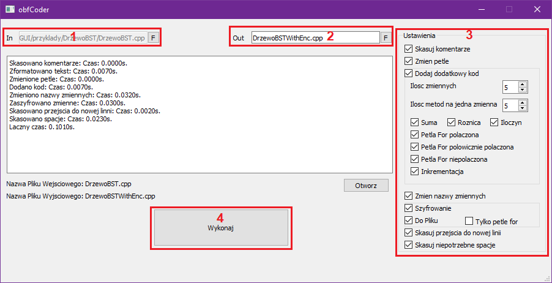

# obfCoder
Simple obfuscator for source code written in language C++.

## Configuration

### Compiling
1. Clone or download the repository.
2. Run obfCoder.sln preferably Visual Studio 2019.
3. Make sure you have connected Qt Designer to your environment.
	3.1 Qt Visual Studio Tools, which can be found in Visual Studio extensions, is helpful in connection.
4. Make sure you have added OpenSSL libraries for Debug and Release x64. Compiled libraries are included with the project.
	4.1 The included openSSL libraries are only for x64. I can recommend this tutorial if you want to compile them on your own.
	Also, It is also shown here how to connect the openSSL libraries.
		https://www.youtube.com/watch?v=PMHEoBkxYaQ 
5. Done, the project should now compile and run.
	5.1 To the obfCoder.exe file, add the qt dll libraries from the ./GUI/dlls folder to run the application.


## Technology
- [Qt 5.9.9](https://www.qt.io/developers)
- [OpenSSL](https://www.openssl.org/)
- [Visual Studio 2019](https://visualstudio.microsoft.com/)
- Language C++
 


## Program handling

1. Use to 'F' button to choose file for obfuscation
2. In the second field enter the name of the output file, e.g. test.cpp
	2.1 Then choose by next button 'F' the path to save the final file.
	This is important because the name and path will change only after you confirm it in the folder select dialog.
3. Select the options you want to use from the box to the right.
4. Then click the *Execute* button. A blacked-out file should be generated in the specified folder.

## Features

### Delete comments
This option searches after each line of comment text or comment blocks and deletes them
Delete spaces where possible.


Before:
```cpp
double x1 = 0; //Comment
/* Block // :)
*/
```
After:
```cpp
double x1 = 0; 
```
### Change loops
The option searches for nested loops and transforms them into a single loop.
The function only works for cases starting iterations from 0. 
In addition, it should not be used on loops that contain zero elements after an external loop.

Before:
```cpp
int main() 
{ 
    for (int i = 0; i < 5; i++) 
    { 
        for (int j = 0; j < 3; j++) 
        { 
             std::cout << i*j << " "; 
        } 
    } 
return 0; 
} 
```
After:
```cpp
int main( ) 
int main( ) 
{ 
    for( int t = 0 ; t < ( 5 * 3 ) ; t ++ ) 
    { 
    std::cout << ( t / ( 3 * 1 ) ) * ( t % ( 3 * 1 ) )  << " " ; 
    } 
return 0 ; 
} 
```

### Add Additional code
This option adds loop or other blocks to the code that do not affect the operation but make it harder to read.
There are two main arguments here:
- Number of variables - parameter responsible for the number of variables, to which such code will be added
- Number of methods per one variable - Parameter responsible for the number of methods added to one variable
Then we have the methods, which are chosen randomly, but we have the ability to take into account the methods entering the draw.


- Sum/Difference/Multiply - They work on the same principle. e.g. They add something to a variable and then subtract
Before:
```cpp
int test = 15;
```
After:
```cpp
int test = 15 ; 
	 test += 2;
	 test -= 2;
```


- Loop For connected - Adds a loop where it adds 1 to the variable n-times and then deletes it
Before:
```cpp
int test = 15;
```
After:
```cpp
int test = 15 ; 
 
	 int ou ; 
	 for( ou = 0; ou < 3; ou ++) { 
 	 test ++; }
	 test -= 3;
```


- Loop For semi-connected - Similar to the linked loop, only instead of relying on a variable it creates a new one on which it makes changes. 
The main variable itself serves as a value to assign to the new variable.
Before:
```cpp
int test = 15;
```
After:
```cpp
int test = 15 ; 
 
	 int di = 0; 
	 bool kd = true; 
	 int sp ; 
	 for( sp = 0; sp < 5; sp ++) {
	 di += (int) test ;
	 if( di ) kd = false; 
 } 
```


Loop For unconnected - It works on the same principle as the polovial, but instead uses a switch statement and the 
main variable is used to determine the location and is not taken anywhere.
Similar to the loop, only instead of relying on a variable it creates a new one on which it makes changes. The main variable itself serves as a value to assign to the new variable.

Before:
```cpp
int test = 15;
```
After:
```cpp
int test = 15 ; 
 
 	 int am = 0; 
	 int el = 1; 
	 int yy ; 
	 for( yy = 0; yy < 0; yy ++) {
	 am *= el ;
	 switch( am )  { 
 case 0: el = 0; 
 break; 
 case 1: el = 1; 
 break;
 case 3: el = 3; 
 break; 
 case 7: el = 7; 
 break; 
 case 10: el = 10; 
 break; 
 default: el = 14; 
 break; }
 }
```

Incrementation - Increments the variable n times and then undoes the whole process. \
```cpp
int test = 15;
```
After:
```cpp
int test = 15 ; 
	 test ++ ;
	 test ++ ;
	 test ++ ;
	 test -- ;
	 test -- ;
	 test -- ;
```
### Rename variables
This option searches for all variables in the text that are of basic types. Then, it converts them into a random UNICODE character.

Before:
```cpp
int test = 15;
double test2 = 20;
string obfCoder = "obfCoder";
```
After:
```cpp
int 倓 = 15 ; 
double 弫 = 20 ; 
string 囊 = "obfCoder" ; 
```

### Encryption
Option using OpenSSL libraries to encrypt values in code with AES algorithm.
The function adds libraries and decryption functions to the code. 
It is important to add OpenSSL libraries to the solution of the file that is being obfuscated.
The option itself has two possibilities:
- To File - A "key.txt" file is generated with the key to be decrypted.
- For Pies Only - Only the values in the for function headers are encrypted.


Before:
```cpp
int test = 15;
double test2 = 20;
string obfCoder = "obfCoder";
```
After:
```cpp
#include <string>
#include <fstream>
#include <openssl/aes.h>
int adxux333(unsigned char* wpqai532, int istzp349) {
std::ifstream file("key.txt"); 
 std::string str; 
 std::getline(file, str); 
 unsigned char* wfdb0285 = (unsigned char*)str.c_str(); 
 AES_KEY qhazb092;
  unsigned char symzr361[80];
 AES_set_decrypt_key(wfdb0285, 128, &qhazb092);
	AES_decrypt(wpqai532, symzr361, &qhazb092);
std::string llfuz352; 
 for (const auto& ittfq612 : symzr361) 
 llfuz352 += ittfq612; 
 return stoi(llfuz352) - istzp349; }
int test = adxux333((unsigned char*)"\xdb\x6f\x32\x19\xe9\x76\xc\x1c\x1f\x6b\xb4\xf2\x6f\xbf\x3e\xb4\x1\x0\x0\x0\x1a\x2\x0\x0\x25\x23\xa7\xe7\xf6\x7f\x0\x0\x20\x74\x4f\xc4\x47\x0\x0\x0\x28\x4a\x57\xd2\x1a\x2\x0\x0\x98\x7e\x4f\xc4\x47\x0\x0\x0\x1\x0\x0\x0\x0\x0\x0\x0\xdc\x8f\xab\xe7\xf6\x7f\x0\x0\x10\x74\x4f\xc4\x47\x0\x0\x0" , 369096511 ) ; 
double test2 = adxux333((unsigned char*)"\x8a\x30\xe7\x6\x6\x4d\x16\x8b\x49\x75\xef\x7a\xf3\x0\x9\xd6\x1\x0\x0\x0\x1a\x2\x0\x0\x25\x23\xa7\xe7\xf6\x7f\x0\x0\x20\x74\x4f\xc4\x47\x0\x0\x0\xb8\x4d\x57\xd2\x1a\x2\x0\x0\x98\x7e\x4f\xc4\x47\x0\x0\x0\x1\x0\x0\x0\x0\x0\x0\x0\xdc\x8f\xab\xe7\xf6\x7f\x0\x0\x10\x74\x4f\xc4\x47\x0\x0\x0" , 1201805486 ) ; 
string obfCoder = "obfCoder" ; 
```
### Delete transitions to new line
It requires the *Delete comments* option to work. This deletes the *\n* character in all possible places. 

Before:
```cpp
#include<string>
int test = 15;
double test2 = 20;
string obfCoder = "obfCoder";
```
After:
```cpp
#include<string>
int test = 15;double test2 = 20;string obfCoder = "obfCoder";
```
### Delete unnecessary space
Delete spaces where possible.

Before:
```cpp
#include<string>
int test = 15;
double test2 = 20;
string obfCoder = "obf" + test2 + "Coder";
```
After:
```cpp
#include<string>
int test=15;
double test2=20;
string obfCoder="obf"+test2+"Coder";
```
### Notes and Tips
- Text is formatted with spaces when using options other than deleting comments.
- Functions in an obfuscated file should be written together with their definitions. 
The prototype itself can cause problems when adding additional code to functions.
- All variables must be initialized when created.
There is also a problem with extra code that can add artymetic expressions with uninitialized variables.
- You should avoid if or for statements without curly brackets and also preferably start and end them on new lines.
## License
MIT

## ACKNOWLEDGEMENTS
This research was supported by ZUT Highfliers School (Szkoła Orłów ZUT) project, co-ordinated by Dr. Piotr Sulikowski, within the framework of the program of the Minister of Education and Science (Grant No. MNiSW/2019/391/DIR/KH, POWR.03.01.00-00-P015/18), co-financed by the European Social Fund, the amount of financing PLN 1,704,201,66.  